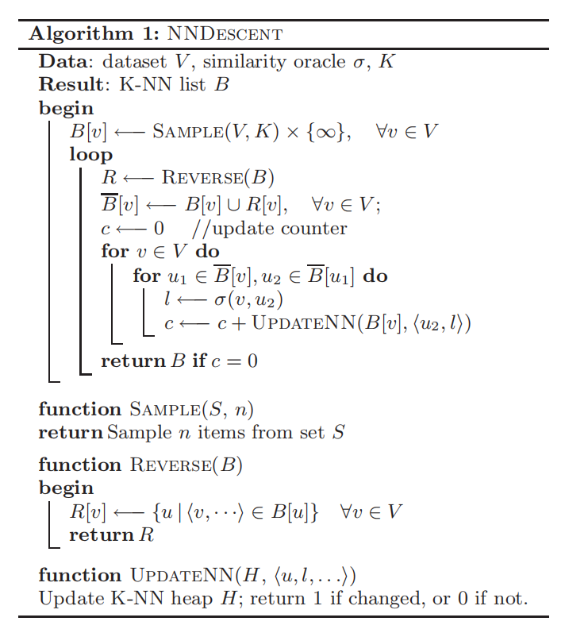

# Notations and Background

## Basic Notations

- $B_K(v)$: Node $v$'s K-NN;
- $R_K(v) = \{u \in V\ |\ v \in B_K(u)\}$: Node $v$'s reverse K-NN;
- $B_r(v) = \{v \in V\ |\ d(u,v) \le r\}$

## Growth Restricted Space

A metric space $V$ is said to be growth restricted if there
exists a constant $c$,

$$
|B_{2r}(v)| \le c |B_r(v)|, \forall v \in V, r \in [0, +\infty)
$$

## Key Observation

Key Obeservation: a neighbor of a neighbor is also likely to be a neighbor.

> In the following, we use the term second-order neighbors to denote the neighbors of neighbors.

This observation can be quantified by the following heuristic proof:

Assuming that $V$ is a growth restricted metric space. Let growth constant $c$ be: 

$$
c = \sqrt[3]{K}
$$

> Where K is the number of nearest neighbors.

